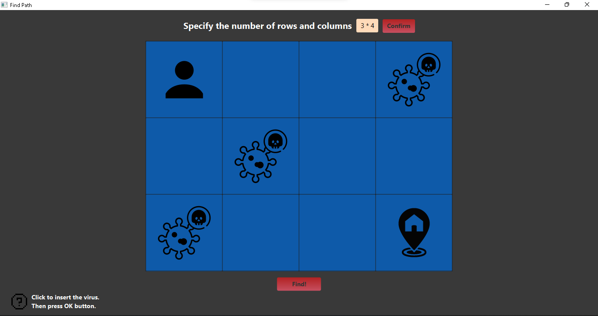
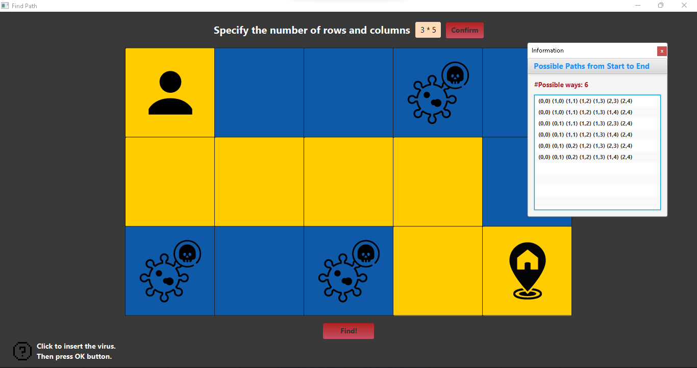
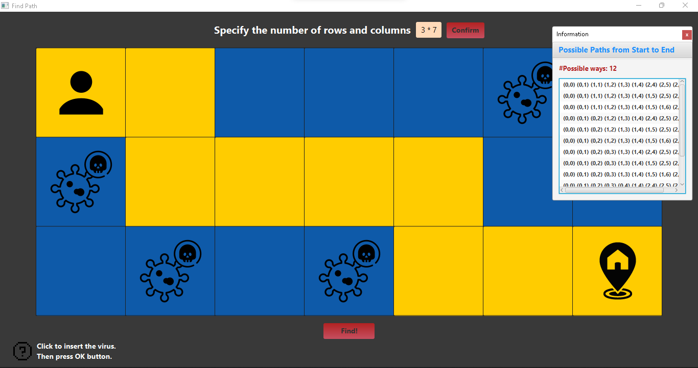

# Path Finder

## Project Definition

This project originated as an assignment during the COVID-19 pandemic in a "Basics of Compounds" class. The goal was to find the shortest path on a grid where only downward and rightward movements were allowed. I expanded this initial idea by introducing obstacles (representing viruses) in the middle of the path and aimed to find all possible safe routes from the starting point to the destination.
Below is a screenshot of the program environment before any path calculation is performed, with randomly placed viruses:

## Project Summary

In the `Main.java` file, you can switch between two modes:
- **Mode 2020:** Set the variable `private static boolean mode_2020 = true;` to view the original implementation of the pathfinding algorithm. This version is based on `PathCounter.java` and `PathCoordinates.java`, which will be briefly explained later.
  
- **Current Version:** Set `private static boolean mode_2020 = false;` to run the improved version of the project, which utilizes both Breadth-First Search (BFS) and Depth-First Search (DFS) algorithms (with `PathCounter.java` and `PathCoordinates.java` no longer needed in this version). This version highlights the shortest path among all possible paths found.

## 🔹Overview - Old Version

### ☑️PathCounter.java

The `PathCounter` class provides a method to count the number of unique paths in a grid from the top-left corner to the bottom-right corner while avoiding obstacles.

### Features
- **Dynamic Programming Approach:** The algorithm uses dynamic programming to efficiently count the number of valid paths.
- **Obstacle Handling:** It handles obstacles that block paths, ensuring that the count only includes valid routes.

### How It Works
1. **Initialization:**
   - A 2D array `numberOfPah` is created to store the number of paths to each cell.
   - Flags are used to check if the first row or column contains an obstacle (`*`), setting paths to 0 if found.
2. **Base Case:**
   - If an obstacle is found in the first row or column, all subsequent cells in that row/column will have 0 paths.
   - For the first row and column without obstacles, paths are initialized to 1.
3. **Dynamic Programming Calculation:**
   - For each cell `(i, j)` that isn't an obstacle, the number of paths is the sum of:
     - Paths from the cell above `(i-1, j)`.
     - Paths from the cell to the left `(i, j-1)`.
4. **Result:**
   - The bottom-right cell (`numberOfPah[row-1][column-1]`) contains the total number of unique paths.

### ☑️PathCoordinates.java

This program generates the coordinates of paths from the top-left corner to the bottom-right corner of a grid while avoiding obstacles (`*`). It uses a stack-based backtracking approach to find the specified number of paths. Through the process of creating this algorithm, I realized that it naturally embodies the principles of DFS. Although I was not initially aware of DFS, the structure of my solution reflects key aspects of this algorithm.

### How It Works
1. **Initialization:**
   - The `table` represents the grid, and `stack` keeps track of the coordinates as the algorithm traverses the grid.
   - The end point at the bottom-right corner is marked as `'E'`.
2. **Traversal:**
   - The algorithm starts at the top-left (i=0, j=0), and moves either down or right based on available options.
   - Each cell's direction is marked (`'B'` for both directions, `'D'` for down, `'R'` for right).
   - If the algorithm reaches the end point, it records the path and continues until the desired number of paths (`numberOfPath`) is found.
3. **Backtracking:**
   - When no further moves are possible (both down and right are blocked), it backtracks by popping cells from the stack until it finds a valid move.
4. **Result:**
   - The algorithm stores the generated paths in `coordinatesList`, which is returned as a `ListView` of strings representing the paths.

## 🔹Overview - New Version

### ☑️AllPathsDFS.java

This program finds all possible paths from the top-left corner to the bottom-right corner of a grid while avoiding obstacles (`*`). It uses a Depth-First Search (DFS) algorithm to explore all valid paths.

### How It Works
1. **Initialization:**
   - The `Cell` class represents a point in the grid with its `x` and `y` coordinates.
   - The `findAllPaths` method initializes the search by checking if the start or end cell is blocked. If either is blocked, it returns an empty list.
2. **Depth-First Search (DFS):**
   - The `dfs` method explores the grid recursively:
     - It checks if the current cell is out of bounds, blocked, or already visited.
     - If valid, it adds the cell to the current path and marks it as visited.
     - If the destination is reached, it adds the current path to the list of all paths.
     - The method recursively explores the cells below and to the right.
     - After exploring, it backtracks by removing the cell from the current path and marking it as unvisited.
3. **Result:**
   - The algorithm returns a list of all valid paths from the start to the end cell.

### ☑️ShortestPathBFS.java

This program finds the shortest path from the top-left corner to the bottom-right corner of a grid while avoiding obstacles (`*`). It uses the Breadth-First Search (BFS) algorithm to determine the shortest path.

### How It Works
1. **Initialization:**
   - The `Cell` class represents a point in the grid with its `x` and `y` coordinates, the distance from the starting point, and a reference to the previous cell in the path.
   - The `shortestPath` method initializes the search by checking if the start or end cell is blocked. If either is blocked, it returns an empty list.
2. **BFS Implementation:**
   - A queue is used to explore the cells level by level. Each cell is visited, and its neighboring cells (specifically down and right) are checked.
   - For each neighbor, if it is within bounds and not blocked, its distance is updated if a shorter path is found. The cell is then added to the queue.
   - **Note:** The upward and leftward moves are commented out, so currently, only down and right moves are considered.
3. **Path Reconstruction:**
   - If the destination is reached, the algorithm backtracks from the destination cell to the start cell using the `prev` reference, constructing the path.
4. **Result:**
   - The algorithm returns a list of cells representing the shortest path from the start to the end cell.

# Output Examples

Here are some examples of the output generated by the program for different grid inputs.

### Example 1

### Example 2

